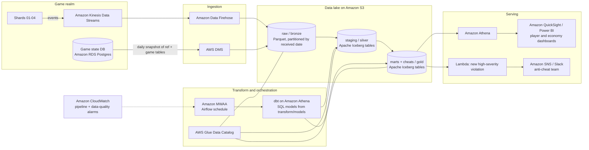

# AWS Production Architecture (diagram only)

How the local solution would run in production. Every local component has a direct managed equivalent, so the SQL
models, cheat rules and report queries move over unchanged.

## How the local pieces map

| Local | AWS | Notes |
|---|---|---|
| Postgres snapshot (Docker) | Kinesis Data Streams (events) + RDS (state) | Events stream continuously instead of a one-off snapshot |
| `ingestion/extract.py` | Data Firehose (events), DMS (state tables) | Firehose writes Parquet partitioned by received time, as locally |
| `data/raw` Parquet | S3 raw / bronze | Same layout |
| DuckDB warehouse | S3 + Apache Iceberg, queried by Athena | Iceberg gives table updates and time travel |
| `transform/run.py` + SQL models | dbt (dbt-athena) scheduled by MWAA | The SQL files become dbt models (ADR 0003) |
| `dq.dq_summary`, reconciliation manifest | dbt tests + CloudWatch alarms | Alert when duplicates, gaps or clock skew exceed a threshold |
| `cheats.*` rule engine | dbt models + Lambda alert on new high-severity rows | Anti-cheat team notified within the batch interval |
| `reports/sql` | Athena views behind QuickSight or Power BI | Same queries |

## Production changes compared with the local version

* **Incremental loads:** process new events by received hour instead of rebuilding everything (dbt incremental
  models keyed on `server_event_id`, which also deduplicates late redeliveries).
* **Clock-skew detection is automated:** a data-quality check on `received_at - event_ts` per shard per hour
  raises an alarm and proposes a correction row instead of relying on manual discovery.
* **Lost-event monitoring:** `shard_seq` gaps are tracked per shard per hour; a sudden rise is an alert.
* **Near real time for the worst cheats:** burst damage and item duplication can be detected in the stream
  (Kinesis Data Analytics / Managed Flink) within seconds, while the full rule set runs in batch.
* **Security:** S3 encryption with KMS, Lake Formation permissions per layer, no direct access to raw player data
  for dashboard users.
