# Seeing the Star Schema in Power BI

The star schema already exists in the warehouse (schema `marts`). This guide loads it into Power BI Desktop and
connects the tables, so you can see the model in **Model view** and build report visuals on it.

**In plain English:** the *fact* tables (names start with `fct_`) record things that happened. The *dimension*
tables (names start with `dim_`) describe who, where, what and when. In Power BI you load both kinds and draw a
line from each dimension to the facts that use it. Drawn out, the dimensions sit around the facts like the points
of a star.

## Step 1: Export the tables for Power BI

Power BI cannot open a DuckDB file, but it reads Parquet files. In the VS Code terminal, with `(.venv)` active:

```powershell
python transform\run.py                 # only if you have not rebuilt since the last update
python reports\export_for_powerbi.py
```

This writes one file per table to `data\powerbi\` (about 70 MB, a few seconds).

## Step 2: Load the tables into Power BI Desktop

1. Open **Power BI Desktop**, then **Home → Get data → More… → Parquet → Connect**.
2. In **URL** (it also accepts a file path), paste the full path of one file, for example
   `C:\Users\danie\Downloads\Eternal realms\data\powerbi\dim_character.parquet`, then **OK → Load**.
3. Repeat for each of these 16 files (dimensions first is easiest):

   | Dimensions (6) | Facts (10) |
   |---|---|
   | dim_date | fct_sessions |
   | dim_character | fct_encounter_participation |
   | dim_character_level | fct_creature_kills |
   | dim_zone | fct_deaths |
   | dim_item_template | fct_xp |
   | dim_creature | fct_loot |
   | | fct_gold_ledger |
   | | fct_economy_transactions |
   | | fct_character_gear |
   | | fct_subzone_activity |

   Optional, for a cheat page: `cheat_violations`, `cheat_offenders`, `cheat_rule_results`.

**Faster alternative (one query per table):** **Get data → Blank query → Advanced Editor**, paste the lines below,
change the file name, **Done**, then rename the query to the table name. Repeat per table.

```
let
    Source = Parquet.Document(File.Contents("C:\Users\danie\Downloads\Eternal realms\data\powerbi\fct_loot.parquet"))
in
    Source
```

## Step 3: Turn off automatic relationships

Power BI guesses relationships from matching column names and sometimes guesses wrong (for example on `zone_id`).
Before or after loading: **File → Options and settings → Options → Current file → Data Load**, untick
**Autodetect new relationships after data is loaded**. If some were already created, delete them in Model view
(right-click a line → **Delete**).

## Step 4: Create the relationships

Open **Model view** (the third icon on the left). Drag a key column from the dimension onto the matching column in
the fact. Every relationship is **Many to one (*:1)**, from the fact to the dimension, with
**cross-filter direction: Single**.

| Dimension (one side) | Key | Fact tables (many side) and their column |
|---|---|---|
| **dim_date** | `date_day` | fct_sessions[`session_date`], fct_encounter_participation[`encounter_date`], fct_creature_kills[`kill_date`], fct_deaths[`death_date`], fct_xp[`xp_date`], fct_loot[`loot_date`], fct_gold_ledger[`ledger_date`], fct_economy_transactions[`transaction_date`], fct_subzone_activity[`activity_date`] |
| **dim_character** | `character_id` | fct_sessions, fct_encounter_participation, fct_deaths, fct_xp, fct_loot, fct_gold_ledger, fct_economy_transactions, fct_character_gear *(one to one)*, cheat_violations, cheat_offenders *(one to one)* — all on `character_id` |
| **dim_zone** | `sub_zone_id` | fct_encounter_participation, fct_creature_kills, fct_deaths, fct_loot, fct_subzone_activity — all on `sub_zone_id` |
| **dim_creature** | `creature_id` | fct_encounter_participation, fct_creature_kills, fct_xp, fct_loot — all on `creature_id` |
| **dim_item_template** | `item_template_id` | fct_loot, fct_economy_transactions — both on `item_template_id` |

`dim_character_level` stays **unconnected** on purpose: it holds each character's level *between two dates*, which
a Power BI relationship cannot express. The level a character had during a fight is already copied into
`fct_encounter_participation[level_at_start]` and `[bracket_min_level]`, so peer comparisons work without it.

When you finish, Model view shows `dim_date`, `dim_character`, `dim_zone`, `dim_creature` and `dim_item_template`
each connected to several `fct_` tables: that picture is the star schema. A screenshot of it is a good slide for
the presentation.

## Step 5: Check it works (two quick visuals)

* **Players killed by bosses vs players:** a clustered bar chart with `fct_deaths[killer_category]` on the axis and
  *Count of* `event_id` as the value. Expected: player 11,165, creature 1,983, boss 0.
* **Items looted by day by rarity:** a stacked column chart with `dim_date[date_day]` on the axis,
  `fct_loot[rarity]` as the legend and *Count of* `event_id` as the value.

If both show numbers, the relationships work.

## The model as a diagram

GitHub draws this diagram automatically (in VS Code it needs the *Markdown Preview Mermaid Support* extension).

```mermaid
erDiagram
    dim_date ||--o{ fct_sessions : "date_day = session_date"
    dim_date ||--o{ fct_encounter_participation : "date_day = encounter_date"
    dim_date ||--o{ fct_creature_kills : "date_day = kill_date"
    dim_date ||--o{ fct_deaths : "date_day = death_date"
    dim_date ||--o{ fct_loot : "date_day = loot_date"
    dim_date ||--o{ fct_gold_ledger : "date_day = ledger_date"
    dim_character ||--o{ fct_sessions : character_id
    dim_character ||--o{ fct_encounter_participation : character_id
    dim_character ||--o{ fct_deaths : character_id
    dim_character ||--o{ fct_xp : character_id
    dim_character ||--o{ fct_loot : character_id
    dim_character ||--o{ fct_gold_ledger : character_id
    dim_character ||--o{ fct_economy_transactions : character_id
    dim_character ||--|| fct_character_gear : character_id
    dim_zone ||--o{ fct_encounter_participation : sub_zone_id
    dim_zone ||--o{ fct_creature_kills : sub_zone_id
    dim_zone ||--o{ fct_deaths : sub_zone_id
    dim_zone ||--o{ fct_loot : sub_zone_id
    dim_zone ||--o{ fct_subzone_activity : sub_zone_id
    dim_creature ||--o{ fct_encounter_participation : creature_id
    dim_creature ||--o{ fct_creature_kills : creature_id
    dim_creature ||--o{ fct_xp : creature_id
    dim_creature ||--o{ fct_loot : creature_id
    dim_item_template ||--o{ fct_loot : item_template_id
    dim_item_template ||--o{ fct_economy_transactions : item_template_id
```



Grain of each table, and why it is built this way: [data-model.md](data-model.md).
